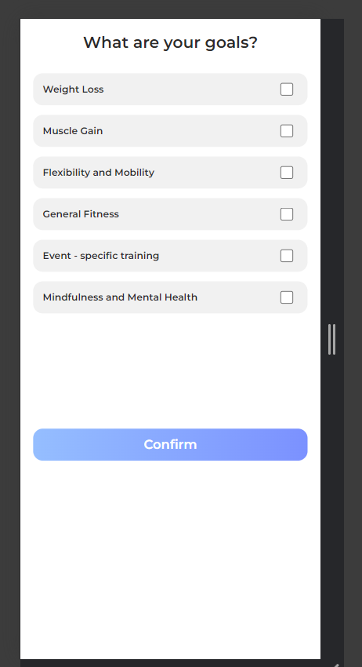

# Dacoid Assignment

[Home](https://661f7e8c7b1026f4d6002523--effortless-otter-f24bcb.netlify.app/index.html "Home") | [Next](https://661f7e8c7b1026f4d6002523--effortless-otter-f24bcb.netlify.app/index.html "Next") | [Login](https://661f7e8c7b1026f4d6002523--effortless-otter-f24bcb.netlify.app/signup.html "Login") | [Schedule](https://661f7e8c7b1026f4d6002523--effortless-otter-f24bcb.netlify.app/workout-schedule.html "Schedule") | [Goals](https://661f7e8c7b1026f4d6002523--effortless-otter-f24bcb.netlify.app/goals.html "Goals") | [Workout-Tracker](https://661f7e8c7b1026f4d6002523--effortless-otter-f24bcb.netlify.app/workout-tracker.html "Track Workout")

## Home Page

Each next button on the page links to next page

## Login Page

create account link links to registeration page user can go to register page using this link

## Schedule Page

## Goals Page

## Workout-Tracker-Page

